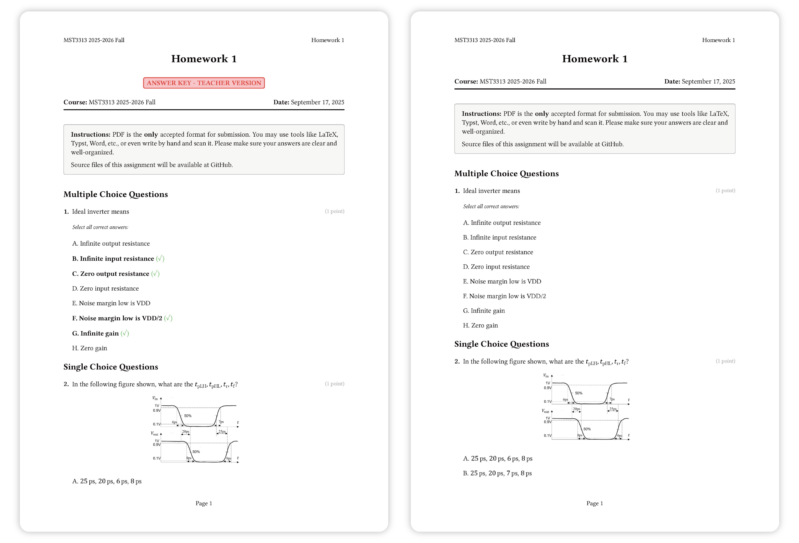

# Assignly

[](https://typst.app/)

Assignly is a comprehensive Typst template for creating academic assignments and quizzes. It provides a dual-mode system that generates both student and teacher versions from a single source, supports multiple question types, and handles bilingual content with advanced typography.

<div align="center">
  
  <p style="font-size: 0.8em;">
    <i>Assignly Teaser: Teacher version (left) and Student version (right).</i>
  </p>
</div>

## ✨ Features

- **Six Question Types**: Single-choice, multiple-choice, true/false, fill-in-the-blank, short answer, and multi-part questions
- **Dual-Mode Rendering**: Generate student and teacher versions with a single parameter
- **Math Formula Support**: Questions support both string and content types for rich formatting and mathematical expressions
- **Bilingual Support**: Advanced font fallback system for mixed Latin/CJK content
- **Professional Typography**: Optimized layout and spacing for academic documents
- **Customizable Styling**: Configurable fonts, colors, and formatting options
- **Rich Formatting**: Support for mathematical expressions, code blocks, and images
- **Modular Architecture**: Clean, maintainable codebase with separated concerns

## 🚀 Quick Start

### Installation

1. Install [Typst](https://typst.app/) (version 0.13 or later)
2. Download or clone this repository
3. Import the template in your Typst document

### Basic Usage

```typst
#import "src/assignly.typ": *

#assignment(
  title: "Mathematics Quiz 1",
  course: "MATH 101",
  due-date: "September 18, 2025",
  author: "Dr. Smith",
  instructions: "Answer all questions. Show your work.",
  show-answers: false,  // Set to true for teacher version
  show-points: true     // Set to false to hide point values
)[

  #single-choice(
    "What is 2 + 2?",
    ("3", "4", "5", "6"),
    1,  // Index of correct answer (0-based)
    points: 2,
    explanation: "Basic arithmetic: 2 + 2 = 4"
  )

  #true-false(    "The Earth is flat.",
    false,
    points: 1,
    explanation: "The Earth is approximately spherical."
  )

  #short-answer(
    "Explain the Pythagorean theorem.",
    answer: "In a right triangle, the square of the hypotenuse equals the sum of squares of the other two sides: a² + b² = c²",
    points: 5,
    answer-lines: 3
  )
]
```

### Compile Your Document

```bash
# Generate student version
typst compile --root . assignment.typ student-version.pdf

# Generate teacher version (change show-answers to true in your file)
typst compile --root . assignment-teacher.typ teacher-version.pdf
```

## 📚 Documentation

### Main Function: `assignment()`

The main template function that sets up your document structure.

```typst
#assignment(
  title: "Your Assignment Title",          // Required
  course: "Course Code",                   // Optional
  due-date: "Date",                        // Optional
  author: "Instructor Name",               // Optional
  instructions: "General instructions",    // Optional
  show-answers: false,                     // Boolean: student (false) or teacher (true) mode
  show-points: true,                       // Boolean: show (true) or hide (false) point values
  font-latin: "Times New Roman",           // Latin font family
  font-cjk: "SimSun",                      // CJK font family
  // ... content goes here
)
```

### Question Types

#### Single Choice Questions

```typst
#single-choice(
  "Question text",
  ("Option A", "Option B", "Option C", "Option D"),
  2,  // Index of correct answer (0-based)
  points: 3,
  explanation: "Why this answer is correct"
)
```

#### Multiple Choice Questions

```typst
#multiple-choice(
  "Question text",
  ("Option A", "Option B", "Option C", "Option D"),
  (0, 2),  // Indices of correct answers
  points: 4,
  explanation: "Explanation of correct answers"
)
```

#### True/False Questions

```typst
#true-false(
  "Statement to evaluate",
  true,  // Correct answer
  points: 2,
  explanation: "Why this is true/false"
)
```

#### Fill-in-the-Blank

**String Mode:**

```typst
#fill-blank(
  "The capital of France is ___.",
  ("Paris",),  // Array of acceptable answers
  points: 2,
  blank-width: "3cm",  // Optional: customize blank width
  explanation: "Paris is the capital and largest city of France."
)
```

**Content Mode (supports math & formatting):**

```typst
#fill-blank(
  [The derivative of $f(x) = x^2$ is $f'(x) = $ #fill-blank-space(answer: "2x")],
  (), // Empty answers array for content mode
  points: 3,
  explanation: "Using the power rule"
)
```

#### Short Answer Questions

```typst
#short-answer(
  "Explain the water cycle.",
  answer: "The water cycle involves evaporation, condensation, and precipitation...",
  points: 10,
  answer-lines: 5,  // Number of lines for student response
  explanation: "Look for mention of key processes and their sequence."
)
```

#### Multi-Part Questions

```typst
#multi-part(
  "Main question prompt:",
  (
    [First sub-question],
    [Second sub-question],
    [Third sub-question]
  ),
  points: 15  // Total points for all parts
)
```

### Utility Functions

#### Section Headers

```typst
#section("Section Title", instructions: "Section-specific instructions")[
  // Section content
]
```

#### Answer Spaces

```typst
#answer-space(
  lines: 5,
  line-height: 2em,
  line-style: 0.5pt + gray
)
```

#### Note Boxes

```typst
#note-box("Important information", type: "info")    // Blue info box
#note-box("Warning message", type: "warning")       // Yellow warning box
#note-box("Error message", type: "error")           // Red error box
#note-box("Success message", type: "success")       // Green success box
```

#### Image Figures

```typst
#image-figure(
  "path/to/image.png",
  caption: "Figure caption",
  width: 80%
)
```

#### Separators

```typst
#separator()                    // Default separator
#separator(style: 2pt + blue)   // Colored separator
```

## 🌐 Bilingual Support

Assignly automatically detects and handles multiple languages:

```typst
#assignment(
  title: "语言学习测试 / Language Learning Test",
  font-latin: "Times New Roman",
  font-cjk: "SimSun",
  show-answers: false
)[
  #single-choice(
    "Which is correct? 哪个是正确的？",
    ("Hello 你好", "Goodbye 再见", "Thank you 谢谢", "Sorry 对不起"),
    0,
    points: 2,
    explanation: "Hello 你好 is the standard greeting in both languages."
  )
]
```

## 📁 Project Structure

```tree
Assignly/
├── src/
│   ├── assignly.typ           # Main template file
│   ├── lib/
│   │   ├── utils.typ          # Utility functions and state management
│   │   ├── layout.typ         # Typography and layout system
│   │   └── questions.typ      # Question type implementations
│   └── samples/
│       ├── basic-assignment.typ      # Basic usage example
│       ├── basic-assignment-no-points.typ  # Example with hidden points
│       ├── bilingual-assignment.typ  # Bilingual example
│       └── comprehensive-demo.typ    # Complete feature demo
├── tests/                     # Test files (for development)
└── README.md
```

## 🎯 Examples

### Complete Assignment Example

See `src/samples/basic-assignment.typ` for a comprehensive example with all question types:

```bash
typst compile --root . src/samples/basic-assignment.typ basic-example.pdf
```

### Bilingual Assignment

See `src/samples/bilingual-assignment.typ` for mixed-language content:

```bash
typst compile --root . src/samples/bilingual-assignment.typ bilingual-example.pdf
```

### Feature Demonstration

See `src/samples/comprehensive-demo.typ` for all features:

```bash
typst compile --root . src/samples/comprehensive-demo.typ comprehensive-demo.pdf
```

## ⚙️ Configuration Options

### Font Configuration

The template supports custom font configuration:

```typst
#assignment(
  font-latin: "Times New Roman",    // For Latin text
  font-cjk: "SimSun",               // For Chinese/Japanese/Korean
  // Other parameters...
)
```

### Answer Display Modes

- **Student Mode** (`show-answers: false`): Hides answers and explanations
- **Teacher Mode** (`show-answers: true`): Shows answers, explanations, and additional formatting

### Styling Customization

Individual components can be customized:

```typst
// Custom answer space
#answer-space(lines: 3, line-height: 1.5em, line-style: 1pt + blue)

// Custom note box styles
#note-box("Custom message", type: "success")

// Custom section formatting
#section("Custom Section", numbered: true, instructions: "Special instructions")
```

## 🐛 Troubleshooting

### Common Issues

**Font Warnings**: If you see font family warnings, install the fonts or update the font configuration:

```typst
#assignment(
  font-latin: "Arial",  // Use system-available font
  font-cjk: "Microsoft YaHei",  // Alternative CJK font
  // ...
)
```

**Import Errors**: Make sure to use the correct root path:

```bash
typst compile --root . your-assignment.typ output.pdf
```

## 📰 Code Formatting

We standardize formatting to ensure consistent code style across the team.

- Editor: VS Code + Tinymist (Typst language server)
- Format on save: enabled via `.vscode/settings.json`
- Base style: `.editorconfig` (LF line endings, 2-space indentation)
- Optional CLI: `typstyle` for batch format and CI checks

Quick start:

```powershell
# Install typstyle (optional, for CLI and CI)
cargo install typstyle

# Format all .typ files locally
./scripts/format.ps1

# Check formatting (CI-equivalent)
./scripts/format.ps1 -Check
```

```bash
# Install typstyle (optional, for CLI and CI)
cargo install typstyle

# Format all .typ files locally
bash ./scripts/format.sh

# Check formatting (CI-equivalent)
bash ./scripts/format.sh -c
```

Notes:

- Scripts now use typstyle's current CLI: `--inplace` to write changes, `--check` to verify formatting.
- Scripts accept directories (src/tests/specs) directly; no per-file iteration needed.

CI:

- GitHub Actions workflow `.github/workflows/format.yml` checks formatting on PRs using ubuntu-latest.

## 📄 License

This project is licensed under the Apache 2.0 License - see the [LICENSE](LICENSE) file for details.
